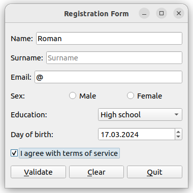
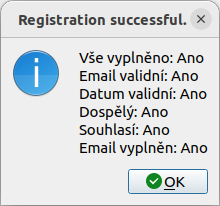

# QT formulář: Registrační formulář


# Řešení 

Mé řešení obsahuje třídu `regWindow`, která je zděděná z QWidget prvku. Hned v jejím konstruktoru je sada přikazů, které vygenerují jednotlivé QT widgety a vloží ho do horizontálního pole (layoutu). 

Interaktivní prvky  (widgety) jsou definovány jako private proměnné uvnitř třídy. 

Ve spodní části okna je trojice tlačítek, poslední z nich slouží k zavření, Je pomocí `connect()` konstruktoru připojena k funkci `onButtonQuit()`, která patří k té samé třídě. 

Zde je jednoduše vyvolána funkce `close()`. 

První tlačítko slouží k validaci vyplněných dat. Provádí se validace jednotlivých bodů definovaných v zadání. Splnění jednotlivých požadavků je v textové podobě složeno v `QString` a následně je vypsáno v podobě `QMessageBox`. Pokud je ve formuláři nějaká chyba, dialog obsahuje ikonku vykřičníku. 

Poslední (resp. prostřední) tlačítko slouží k vymazání formuláře. 


## Screenshoty

Po spusteni aplikace: 


Špatně vyplněný obash:


Po kliknuti na tlačítko `Validovat`:


Kompletní a správné vyplnění:


A validace správného vyplnění:


Po sktisknuti tlačítka `Clear`:


# Kompilace 

``` bash

  mkdir src/build || true
  cd src/build
  cmake ..
  make 
```

Nyní by ve složce `build` měl vzniknout spustitelný soubor `RegistrationForm`. Ten lze rovnou spustit příkazem `./RegistrationForm`.

